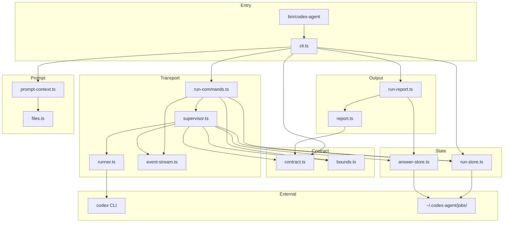
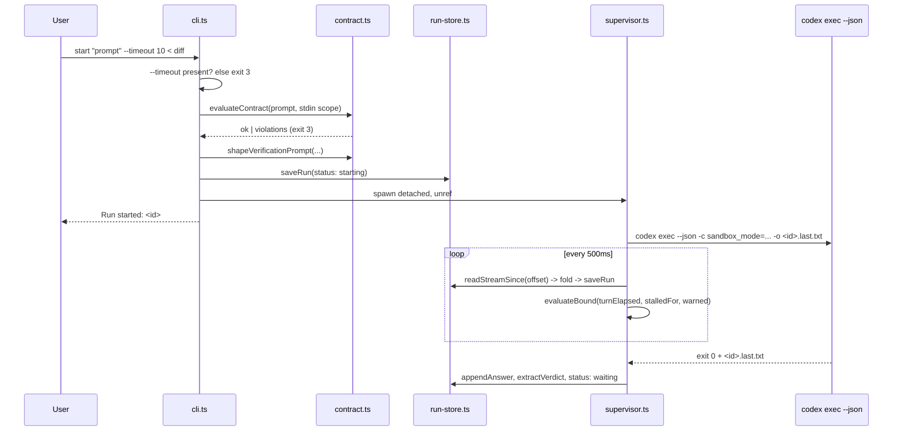

# Codebase Map

> Written by hand against the tree at `last_mapped`, not generated. Every line count below
> comes from `wc -l src/*.ts` on that date.

## System Overview

`codex-agent` runs OpenAI Codex as a **read-only brain** — it plans and it reviews — while
Claude does all the writing. A run is one Codex **thread** driven by N successive
`codex exec --json` processes, each owned by a supervisor process that is awake for the
whole life of the run.

There is no tmux and no terminal scraping anywhere in this tool. The transport is:

- **`codex exec --json`** — one OS process per turn, emitting a typed JSONL event per line.
- **`--output-last-message <file>`** — Codex's own contract for "this is the final answer".
  That file, not anything parsed out of the stream, is the answer of record.
- **`codex exec resume <threadId>`** — how a turn is continued after an interrupt, which is
  what makes both steering and warn-then-kill possible.

The transport this replaced was an interactive Codex TUI inside tmux, scraped with
`capture-pane`. Three modules existed only to compensate for that pane being lossy
(`session-parser.ts`, `usage-parser.ts`, `output-cleaner.ts`) and all three are gone: a typed
event stream needs no glyph-guessing, no session-file archaeology and no regex over a
`script(1)` log.



## Directory Structure

```
codex-agent/
├── bin/
│   └── codex-agent               # Shell wrapper: exec bun src/cli.ts "$@"
├── src/                          # 3,821 lines of module + 2,532 of test
│   ├── cli.ts             686    # Commands, flags, help. Thin by design
│   ├── contract.ts        583    # The invocation contract + the ledger
│   ├── supervisor.ts      487    # One process per run, for the run's whole life
│   ├── run-store.ts       396    # The Run record and its artifacts
│   ├── event-stream.ts    351    # Parsing `codex exec --json`. Pure
│   ├── run-commands.ts    220    # launch / send / refresh / kill
│   ├── report.ts          200    # How a finished run should be read
│   ├── files.ts           187    # Codebase-map lookup
│   ├── bounds.ts          166    # continue | warn | kill. Pure
│   ├── prompt-context.ts  151    # Prompt assembly + token accounting
│   ├── runner.ts          126    # Building `codex exec` argv. Pure
│   ├── answer-store.ts    120    # Durable untruncated answers
│   ├── run-report.ts      109    # Run -> ledger row, Run -> report
│   ├── config.ts           39    # Model, effort, sandbox, jobs dir
│   └── *.test.ts                 # 10 test files, one per module with logic
├── docs/
│   ├── SPEC.md                   # The eleven behaviours. Authoritative
│   ├── CODEBASE_MAP.md           # This file. Injected verbatim by --map
│   └── prompts.md                # Paste-able prompts for a fresh Claude chat
├── plugins/codex-agent/          # The Claude Code plugin (the one skill)
├── scripts/verify-install.sh     # The gate: asserts the spec on this machine
└── package.json                  # No runtime dependencies
```

`docs/SPEC.md` is authoritative. When this map and that file disagree, that file is right.

## The three arguments

The tool is three decisions layered, and each has its own module and its own header comment
recording the measured failure it came from. Read the header before changing any of them.

| Module              | Decides                                                                           |
| ------------------- | --------------------------------------------------------------------------------- |
| `src/contract.ts`   | whether a call may **start** — scope rule, breadth guard, bypass ratchet, verdict |
| `src/bounds.ts`     | whether a running turn may **continue** — continue, warn, or kill                 |
| `src/supervisor.ts` | who is **awake** to act on that decision while a turn is in flight                |

`bounds.ts` is one pure function with two consumers, deliberately: the supervisor can act on
all three outcomes, an observing CLI command can act only on `kill`. Two decision sites would
drift, and the thing that drifts is a ceiling.

Three things are deliberately **not** bounded, each because the evidence refuses them:

- **No token ceiling.** Over 87 recorded runs, the plan judged excellent cost 13.7M tokens
  and the one judged a catastrophe cost 2.8M. No ceiling separates them.
- **No zero-exec fail-fast.** `execCount: 0` is the _healthy_ signature of a scoped pass —
  the shaped prompt tells the agent not to read other files.
- **No single-signal stall rule.** The runaway backstop fires only when events, tokens and
  completed turns are all flat together for 10 minutes. It is a hang detector, not a budget.

## Module Guide

### bin/codex-agent

Shell wrapper. Resolves its own directory through symlinks — this repo is reached through
`~/.codex-orchestrator` — then `exec bun "$SCRIPT_DIR/../src/cli.ts" "$@"`.

---

### src/config.ts

Model, reasoning effort, sandbox, jobs directory. Every value is a deliberate local override
of upstream:

| Value                    | Set to                | Why                                             |
| ------------------------ | --------------------- | ----------------------------------------------- |
| `model`                  | `gpt-5.6-sol`         | strongest available; passed as `-c model=`      |
| `defaultReasoningEffort` | `xhigh`               | never lowered as a cost control                 |
| `defaultSandbox`         | `read-only`           | Codex plans, it does not write                  |
| `jobsDir`                | `~/.codex-agent/jobs` | every run artifact lives here                   |
| `runsListLimit`          | `20`                  | rows shown by `runs` / `ledger` without `--all` |

There is **no timeout default here, or anywhere.** `--timeout <minutes>` is required on every
launch; omitting it is a contract refusal. A default a machine caller inherits silently is not
a bound, it is a habit.

---

### src/contract.ts

Pass profiles and the four rules that decide whether an invocation may start.

| Pass          | effort | sandbox   | word cap | max checks | needs scope | needs verdict |
| ------------- | ------ | --------- | -------- | ---------- | ----------- | ------------- |
| `plan`        | xhigh  | read-only | none     | ∞          | no          | no            |
| `review`      | xhigh  | read-only | 300      | 3          | yes         | yes           |
| `adversarial` | xhigh  | read-only | 400      | 1          | yes         | yes           |
| `mechanical`  | xhigh  | read-only | 200      | 10         | yes         | yes           |

No profile carries a timeout. Bounds are per invocation and come from the caller.

Key exports: `evaluateContract` (the gate), `shapeVerificationPrompt` (the shape that answered
in 51 seconds, kept close to verbatim), `extractVerdict` (the `VERDICT: CLEAN|BROKEN` matcher),
`resolvePassKind`, `countEnumeratedChecks`, `RunLedger` + `LEDGER_HEADER` + `formatLedgerRow`.

The ledger prints `SPENT` and `CUM-IN` as **two columns** and never substitutes one for the
other. They were one column until it was caught reporting the same run as 253k and 1.1M.

---

### src/bounds.ts

`evaluateBound(input) -> { action: "continue" | "warn" | "kill" }`. Pure — every
time-dependent input is passed in, so it is table-testable at exact boundary values with no
clock and no Codex.

- `WARN_FRACTION = 0.85` — at 85% of the bound the agent is interrupted and resumed with
  `buildWrapUpPrompt`, which states how long is left and what a non-answer costs.
- The warn does **not** extend the deadline. Elapsed time is measured across the whole logical
  turn including the resumed continuation.
- `MIN_WARN_REMAINING_MS = 30_000` — below this a warn cannot be concluded inside, so the run
  simply runs to its bound.
- `DEFAULT_STALL_MINUTES = 10` — the runaway backstop.

---

### src/runner.ts

Builds `codex exec` argv. Pure; nothing here spawns anything.

Guards the sharpest edge in the transport, verified against codex-cli 0.145.0:
`codex exec resume` **rejects** `--sandbox` and `-C/--cd`. Dropping the flag on resume — the
obvious fix when the CLI rejects it — would let every steered or warned turn run under
whatever `~/.codex/config.toml` says. So sandbox always travels as `-c sandbox_mode=...` on
both shapes, `--sandbox` is never used, and the working directory is the spawned process's cwd
rather than a flag. `readSandboxFromArgv` lets the supervisor assert this at spawn time.

---

### src/event-stream.ts

Parses `codex exec --json` and folds it into `StreamMetrics`. Pure: strings in, values out.

Observed event shapes are documented in the file header. What the fold produces:
`threadId`, `eventCount` (the liveness signal), `execCount`, `turnsStarted`/`turnsCompleted`,
`tokensSpent`, `cumulativeInputTokens`, `lastAgentMessage`, `lastCommand`, `errors`,
`malformedLines`.

Two deliberate properties: `splitCompleteLines` carries a partial trailing JSON line forward
instead of counting it malformed, and an unrecognised event type folds as `{kind: "other"}` so
a Codex upgrade cannot make a healthy stream look dead. `lastAgentMessage` is for live progress
display only — **never** the answer of record.

---

### src/run-store.ts

The `Run` record and where its artifacts live.

Statuses: `starting` → `running` → `waiting` (a turn concluded; resumable via `send`) →
`completed`, or `failed` (a guard stopped it, Codex exited non-zero, or it produced no answer).

Every artifact path goes through `runArtifactPath`, which validates the id against
`/^[A-Za-z0-9][A-Za-z0-9_-]{0,127}$/` and asserts the result is under the jobs directory, so a
crafted id cannot escape it. `saveRun` is atomic (temp file + rename) because the supervisor
writes on every poll while a separate CLI process reads.

`readStreamSince(id, offset)` reads only the delta. `command_execution` items carry full
command output, so a plan pass running `git diff` over a large tree produces a very large
stream; delta reads keep each poll O(new bytes) rather than O(file).

`purgeOldRuns` **deletes** rather than archives. The previous transport moved artifacts to
`jobs/.trash/` for recoverability and never emptied it — 699 MB across 964 files, while
`clean` reported jobs "cleaned" and freed nothing.

---

### src/supervisor.ts

`bun src/supervisor.ts <runId>`. One process per run, awake for the run's whole life.

The loop: spawn a Codex process, poll it every 500 ms, drain the stream into the run record,
and act on one of four outcomes — `exited`, `steer`, `warn`, `kill`.

- **exited** — `concludeTurn` distinguishes three endings that must not be conflated:
  non-zero exit (stderr says why, now), zero exit with no answer file (verified: pointing `-o`
  at an unwritable path warns on stderr and **still exits 0**), and zero exit with an answer.
- **steer** — a new question. New logical turn, fresh bound, fresh warn budget.
- **warn** — same question. The wrap-up inherits the same deadline, deliberately: resetting it
  would turn a 10-minute bound into 18.5 minutes.
- **kill** — recorded as a breach with its reason and message.

**The single-writer invariant**: exactly one Codex process per thread at any moment. The
supervisor never starts the next until the previous has exited, which is what makes the event
stream and the answer file single-writer and what makes an interrupt land at a boundary this
loop chooses rather than whenever a keystroke reaches a TUI.

`extractFailureReason` skips known-benign stderr progress lines. An untrusted directory writes
two lines and the first is `Reading additional input from stdin...`, so taking the first
non-empty line buried `Not inside a trusted directory` behind progress chatter.

---

### src/run-commands.ts

What the short-lived CLI process calls.

| Export       | Does                                                                                                       |
| ------------ | ---------------------------------------------------------------------------------------------------------- |
| `launchRun`  | write the record, spawn a `detached` + `unref`ed supervisor with `stdio: "ignore"`                         |
| `sendToRun`  | supervisor alive → write a steer file; supervisor gone → start one whose first invocation _is_ the message |
| `refreshRun` | re-derive state from files, then apply the bound (**the backstop**)                                        |
| `killRun`    | SIGTERM the Codex process and the supervisor, record it                                                    |

`refreshRun` is why a bound cannot vanish with a process. A supervisor can die — machine
sleep, OOM, an errant pkill — so every observing command re-folds the stream and applies the
same `evaluateBound`. It cannot warn (that needs a live process holding the child) but it can
and does kill. Leaving one path unbounded is this repo's original sin; the new design does not
get to reintroduce it.

---

### src/answer-store.ts

`<runId>.answer.md` — the untruncated answer, one block appended per concluded turn, written
by the supervisor from the `--output-last-message` file. `readAnswers` parses them back.

A verdict that exists only in a live process is not a verdict. Two failures on 2026-07-28 said
so: one lost a whole planning pass to a dead tmux server, and another reached for the raw
transcript and got 53KB of TUI box-drawing while the answer sat truncated at 500 characters in
the job record.

---

### src/report.ts and src/run-report.ts

`report.ts` owns the **judgement** — how a finished run should be read — and is pure and
table-tested. Ordering matters: a breach is reported before a missing verdict, because a run
killed at its bound has no verdict _because_ it was killed, and the two remedies point
opposite ways.

`run-report.ts` maps a `Run` onto the ledger row and the report shape, and formats the
one-line live progress used by `status` and the `--wait` meter.

---

### src/prompt-context.ts and src/files.ts

`buildPromptContext` assembles the final prompt (optional codebase map, then the task) and
reports byte and token accounting per component, so `--dry-run` can say what a call will cost
before it costs it.

`findCodebaseMap` looks for `docs/CODEBASE_MAP.md`, then `CODEBASE_MAP.md`, and returns the
path **as it exists on disk**. `docs/ARCHITECTURE.md` used to be a third fallback and is gone:
a repo with no map but any architecture document had that document silently injected into
planning prompts. `--map` now means the codebase map or nothing, and the CLI prints which file
it used.

The lookup resolves **every** path segment against real directory entries rather than trying
literal paths, because `readFileSync("docs/ARCHITECTURE.md")` on case-insensitive APFS happily
opens `docs/architecture.md` and then reports a path that does not exist. `chooseEntry` is the
pure core of that, so the case behaviour is tested with synthetic listings and runs identically
on every filesystem.

---

### src/cli.ts

Commands, flags, printing. Deliberately thin: the contract, the bound decision and the process
that enforces both live elsewhere.

| Command                                | Does                                                    |
| -------------------------------------- | ------------------------------------------------------- |
| `start "prompt" --timeout <min>`       | apply the contract, shape the prompt, launch            |
| `status <id> [--json]`                 | what it is doing right now                              |
| `await <id>` (alias `await-turn`)      | block until the current turn concludes                  |
| `send <id> "message"`                  | interrupt an in-flight turn, or continue an idle one    |
| `tail <id> [n]` (alias `capture`)      | last n lines of the raw JSONL event stream (default 40) |
| `report <id> [--json]`                 | asked / answered / ledger / judgement                   |
| `runs [--json] [--all]` (alias `jobs`) | list runs                                               |
| `ledger [--json]`                      | duration, SPENT, CUM-IN, execs, scoped, bypass, outcome |
| `kill <id>`                            | stop a run and its supervisor                           |
| `clean`                                | delete runs older than 7 days                           |
| `health`                               | `codex --version`                                       |

`prepareLaunch` is the single launch path, so there is no way to reach Codex while skipping the
gate. It checks `--timeout` **first**, so the refusal is identical whether or not the rest of
the invocation is well formed.

An unknown subcommand is an **error** (exit 1). It used to fall through and be launched as a
prompt, so a typo like `codex-agent repot abc123` spawned a real Codex run.

## Data Flow

### Launching a run



### Steering, and warn-then-kill

```mermaid
sequenceDiagram
    participant CLI as codex-agent send
    participant Store as <id>.steer
    participant Sup as supervisor.ts
    participant Codex as codex exec

    CLI->>Store: writeSteer(message)
    Sup->>Store: takeSteer() (delivered exactly once)
    Sup->>Codex: SIGTERM, wait for exit
    Sup->>Codex: codex exec resume <threadId> "<message>"
    Note over Sup,Codex: everything already completed is preserved;<br/>a turn killed after 3 of 10 tool calls resumed<br/>and reported all three results
```

Warn-then-kill is the same mechanism with a different prompt: at 85% of the bound the
supervisor interrupts and resumes with `buildWrapUpPrompt`, under the **same** deadline. A
4-minute-bounded run at 18 exec calls was interrupted, resumed, and produced `VERDICT: CLEAN`
instead of dying with nothing.

## Storage Structure

```
~/.codex-agent/jobs/
├── <runId>.run.json         # the Run record (atomic writes)
├── <runId>.jsonl            # codex exec --json events, appended across every invocation
├── <runId>.last.txt         # --output-last-message for the CURRENT invocation
├── <runId>.answer.md        # untruncated answers, one block per concluded turn
├── <runId>.stderr           # where a run that never started explains itself
├── <runId>.steer            # a pending steer; deleted when delivered
└── <runId>.supervisor.log   # how a dead supervisor explains itself
```

`.last.txt` is cleared before every invocation, so a turn that produces no answer cannot
inherit the previous turn's file and be recorded as having answered.

## Conventions

- **Run ids**: 8 hex characters (`randomBytes(4)`).
- **Exit codes**: `0` usable, `1` operational, `3` contract refusal, `4` not a usable result.
- **Pure core, effectful edge**: `bounds.ts`, `event-stream.ts`, `runner.ts`, `report.ts` and
  `chooseEntry` take data and return values. The filesystem, the clock and `spawn` live in
  `supervisor.ts`, `run-store.ts` and `run-commands.ts`.
- **Bun only** — never npm/yarn/pnpm for running. No runtime dependencies.
- **stdin is the scope channel.** There is no `-f`/`--file` flag.

## Gotchas

1. **`codex exec` and `codex exec resume` take different flags.** `--sandbox` and `-C/--cd`
   are rejected on resume. Never add a flag to one shape without checking the other.
2. **`-o` can fail while Codex still exits 0.** Verified on 0.145.0. Exit code alone is not
   evidence that an answer exists; `concludeTurn` checks the file.
3. **stdin is never inherited by the child.** The CLI's stdin may be the pipe carrying the
   diff that is already embedded in the prompt; passing it through would feed Codex the scope
   twice and could hang it waiting on input it does not need.
4. **The last line of a live `.jsonl` is usually half-written.** Use `splitCompleteLines` and
   carry the remainder; folding the fragment inflates `malformedLines` on a healthy run.
5. **A `waiting` run is idle but not finished.** It has no live supervisor, and `send` will
   start a new one that resumes the thread.
6. **`codex-agent tail` is the raw event stream**, not a rendered answer. Use `report`.

## Navigation Guide

**To add or change a CLI command** → `src/cli.ts` (the `switch` in `main`, plus `HELP`).

**To change what a call is allowed to be** → `src/contract.ts`. Read the header first.

**To change when a run is stopped** → `src/bounds.ts` (the decision) and possibly
`src/supervisor.ts` (acting on it). Never add a second decision site.

**To change how Codex is invoked** → `src/runner.ts` for argv, `src/supervisor.ts` for
process handling. Re-read the flag-asymmetry table before touching either.

**To handle a new Codex event type** → `src/event-stream.ts` (`parseEventLine` + `foldEvent`).

**To change what a result looks like** → `src/report.ts` for the judgement,
`src/run-report.ts` for the mapping.

**To change defaults** → `src/config.ts`. There is no timeout default to change.

**To prove a change did not break the install** → `bash scripts/verify-install.sh --all`.
